# OmniNFT 算法 verl-omni 适配设计文档

## 1. 目标、范围与设计原则

> OmniNFT 论文：[arxiv.org/abs/2605.12480](https://arxiv.org/abs/2605.12480)

目标是在 `verl-omni` 中基于 LTX-2.3 实现 OmniNFT 的强化学习训练：

```text
文本条件
  -> old policy 生成多组同步音视频
  -> 五个 Reward 对本地 Batch 分别评分
  -> 每个 Reward 独立计算 advantage
  -> advantage 按音频、视频模态分别路由
  -> video/audio 分别执行 DiffusionNFT loss
  -> 汇总为单一 loss 并更新 default policy
  -> EMA 同步 old policy
```

当前只实现 OmniNFT 的 **modality-decoupled advantage routing（模态解耦优势路由）**，暂不实现：

- layer-wise gradient surgery；
- region-wise loss reweighting；

这两项优化依赖具体模型的双流交叉注意力结构、层级功能划分和视频 token 映射，论文目前也仅在 LTX-2 上完成验证；直接接入还需要修改训练计算图或从 rollout 采集注意力，因此首期保留扩展空间，待基础 RL 闭环验证后再按模型独立评估。

采用以下代码设计原则：

1. **旧路径保持不变**：原 LTX FlowGRPO、Qwen-Image DiffusionNFT 和现有 Reward Manager 继续使用原类及原 registry key。
2. **新路径独立注册**：OmniNFT 通过新 algorithm、loss、engine、pipeline 和 reward manager key 启用。
3. **继承复用**：新增薄子类复用已有 Trainer、FSDP2 engine 和 DiffusionNFT 数学实现，不在旧类中堆叠大量 AV 分支。
4. **通用机制与模型适配分层**：Reward 路由、分模态 loss 和 Batch Reward 生命周期是通用层；LTX latent 布局和联合 forward 属于模型 adapter。

模型与框架分工如下：

| 模块               | 职责                                                                                                     |
| ------------------ | -------------------------------------------------------------------------------------------------------- |
| `vllm-omni`      | 使用 old policy 完成 LTX-2.3 联合 AV rollout，导出 decoded media、两路 clean latent 和 replay conditions |
| `verl-omni`      | 数据、Reward 调度、per-Reward advantage、模态路由、双模态 DiffusionNFT actor、FSDP2/CP、policy 生命周期  |
| Native Reward 函数 | 五个模型的初始化、Batch 预处理与推理、activate/deactivate/finalize                                       |

## 2. 算法核心

### 2.1 联合音视频 Flow Matching

令 $m\in\{v,a\}$ 表示 video 和 audio，$x_0^m$ 为 rollout 得到的 clean latent，$\epsilon^m\sim\mathcal N(0,I)$。Actor update 使用共享 timestep、独立噪声构造两路训练输入：

$$
x_t^m=(1-t)x_0^m+t\epsilon^m.
\tag{1}
$$

其中：

$$
t_v=t_a=t,\qquad \epsilon^v\perp\epsilon^a.
\tag{2}
$$

LTX-2.3 在一次联合 forward 中输出两路 velocity prediction：

$$
v_\theta=(v_\theta^v,v_\theta^a).
\tag{3}
$$

### 2.2 DiffusionNFT 基础目标

对模态 $m$，使用 train policy 与 old policy 构造隐式正、负 velocity：

$$
v_{\theta,m}^{+}=(1-\beta_m)v_m^{old}+\beta_m v_{\theta,m},
\tag{4}
$$

$$
v_{\theta,m}^{-}=(1+\beta_m)v_m^{old}-\beta_m v_{\theta,m}.
\tag{5}
$$

反推出正、负 clean prediction：

$$
\hat x_{0,m}^{+}=x_t^m-tv_{\theta,m}^{+},\qquad
\hat x_{0,m}^{-}=x_t^m-tv_{\theta,m}^{-}.
\tag{6}
$$

令 $\ell_{i,m}^{+}$、$\ell_{i,m}^{-}$ 为归一化 reconstruction loss，则：

$$
\mathcal L_{NFT}^{m}
=\mathbb E_i\left[
A_{max,m}\left(
p_{i,m}\frac{\ell_{i,m}^{+}}{\beta_m}
+(1-p_{i,m})\frac{\ell_{i,m}^{-}}{\beta_m}
\right)
\right].
\tag{7}
$$

$p_{i,m}\in[0,1]$ 是该样本、该模态的 optimality probability。高分样本偏向正策略，低分样本偏向隐式负策略。

### 2.3 五个 Reward 与模态路由

| Reward                   | 路由          | 训练定义                          |                  规模 | 权重 |
| ------------------------ | ------------- | --------------------------------- | --------------------: | ---: |
| VideoAlign               | video         | $(VQ+TA)/2$                     |    Qwen2-VL-2B，约 2B |  1.0 |
| HPSv3                    | video         | 均匀抽 5 帧，取 top 30% 均值      | Qwen2-VL-7B，约 7B 级 |  1.5 |
| Audiobox Aesthetics      | audio         | $(CE+CU+PQ-PC)/40$              |               约 0.1B |  0.5 |
| LAION-CLAP HTSAT unfused | audio         | text/audio cosine 映射至$[0,1]$ |              约 0.15B |  1.0 |
| DeSync / Synchformer     | video + audio | $1/(1+d)$                       |             约 236.6M |  1.0 |

同一 prompt 生成 $G$ 个候选。对 Reward $k$，先在 prompt group 内独立计算 advantage：

$$
A_{i,k}=\frac{R_{i,k}-\mu_{g,k}}{\sigma_{g,k}+\epsilon}.
\tag{8}
$$

经过独立 advantage 计算之后再将分数加权合并。路由结果为：

$$
\widetilde A_{i,v}
=1.0A_{i,VideoAlign}+1.5A_{i,HPSv3}+1.0A_{i,DeSync},
\tag{9}
$$

$$
\widetilde A_{i,a}
=0.5A_{i,Audiobox}+1.0A_{i,CLAP}+1.0A_{i,DeSync}.
\tag{10}
$$

一般化为：

$$
\widetilde A_{i,m}=\sum_{k=1}^{K}A_{i,k}W_{k,m},\qquad
W=
\begin{bmatrix}
1.0&0\\
1.5&0\\
0&0.5\\
0&1.0\\
1.0&1.0
\end{bmatrix}.
\tag{11}
$$

最后分别映射为 video/audio probability：

$$
p_{i,m}=\operatorname{clip}\left(
\frac12+\frac12
\frac{\operatorname{clip}(\widetilde A_{i,m},-A_{max,m},A_{max,m})}
{A_{max,m}},0,1\right).
\tag{12}
$$

### 2.4 第一阶段总 Loss

两种模态分别计算 reference kl：

$$
\mathcal L_{ref}^{m}
=\mathbb E\|v_{\theta,m}-v_m^{ref}\|_2^2.
\tag{13}
$$

总目标为：

$$
\mathcal L
=\lambda_v\mathcal L_{NFT}^{v}
+\lambda_a\mathcal L_{NFT}^{a}
+\lambda_{ref,v}\mathcal L_{ref}^{v}
+\lambda_{ref,a}\mathcal L_{ref}^{a}
.
\tag{14}
$$

必须先在每个模态内部完成 mask、sum/count 和 mean reduction，再按 $\lambda_v,\lambda_a$ 合并，最后只执行一次 backward 和 optimizer step。

## 3. 框架整体设计

### 3.1 OmniNFT 端到端流程

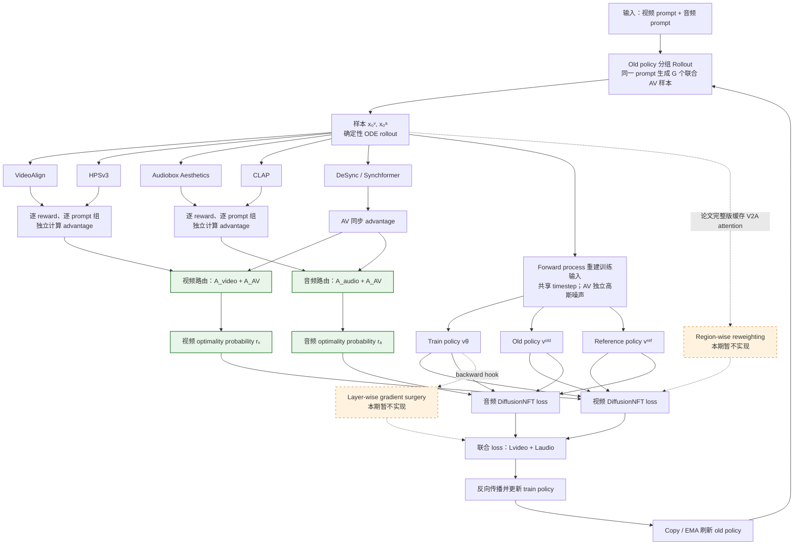

端到端训练由四个阶段构成：首先由 old policy 为同一 prompt 生成 $G$ 个联合音视频样本并保留 video/audio clean latent；随后五个 Reward 分别形成 `[B,K]` Reward 矩阵，并按 prompt group 独立计算 advantage；`ModalityAdvantageRouter` 再将视频质量、音频质量和音画同步分量路由为两路 optimality probability；最后 Actor 使用同一组 rollout latent 重建 $x_t$，完成 old/train/reference 联合 forward、分模态 NFT loss 和一次统一 backward。每轮更新结束后通过 Copy/EMA 刷新 old policy，进入下一轮在线采样。

图中绿色节点是当前首期实现范围，即模态解耦 advantage routing 及两路 probability；橙色虚线节点对应论文中的 region-wise loss reweighting 与 layer-wise gradient surgery，本期暂不实现。Rollout、Reward 和 Actor 之间只通过结构化数据结构传递结果，Reward 不直接计算 advantage，Rollout 也不参与 loss，从而保持三部分能够独立验证和替换。

### 3.2 现有能力组合

现有 recipe pipeline 与可复用关系如下：

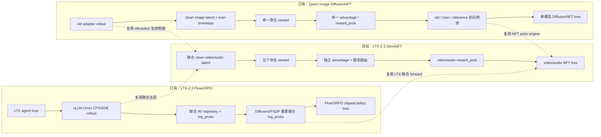

LTX 路径已经具备联合 AV rollout、两路 latent/prediction 和训练后端；Qwen-Image 路径已经具备 clean latent、old/default/reference 生命周期和 forward-process NFT loss。OmniNFT 的目标是复用两者的公共能力，但使用独立注册路径完成组合。

### 3.3 现有类关系

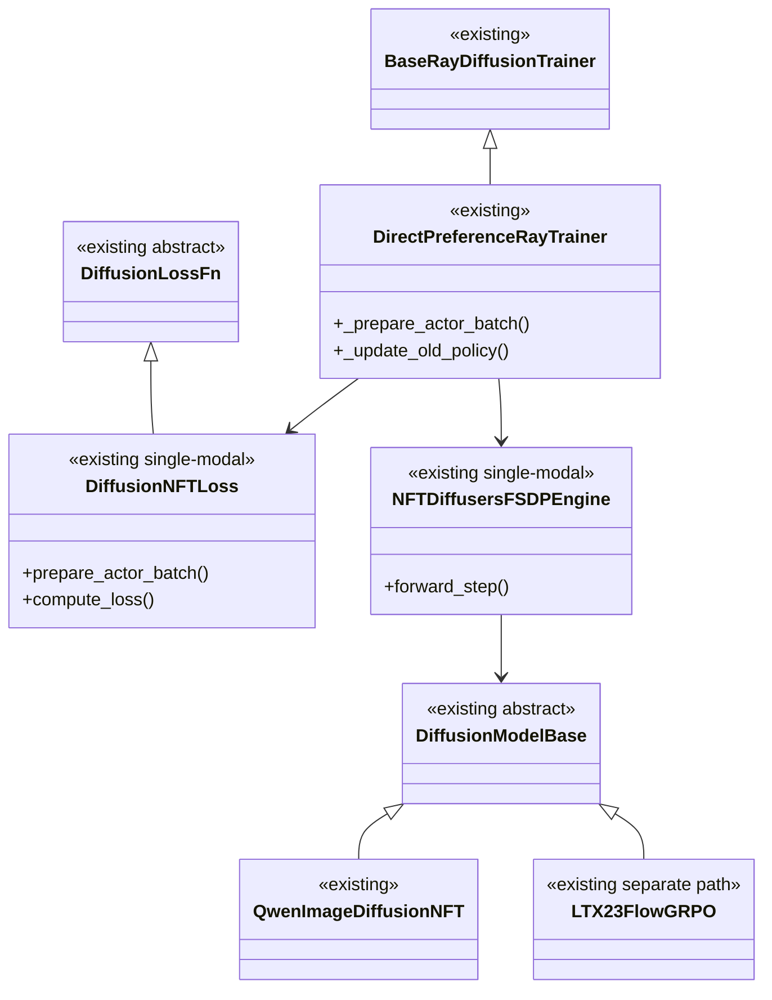

现有路径由 `DirectPreferenceRayTrainer` 负责编排训练，分别调用单模态 `DiffusionNFTLoss` 和 `NFTDiffusersFSDPEngine`；Engine 再通过 `DiffusionModelBase` 对接具体模型 adapter。`QwenImageDiffusionNFT` 与 `LTX23FlowGRPO` 共享模型抽象，但分别服务 DiffusionNFT 和 FlowGRPO，当前无联合音视频的 advantage routing 与分模态 loss。

### 3.4 OmniNFT 目标类关系

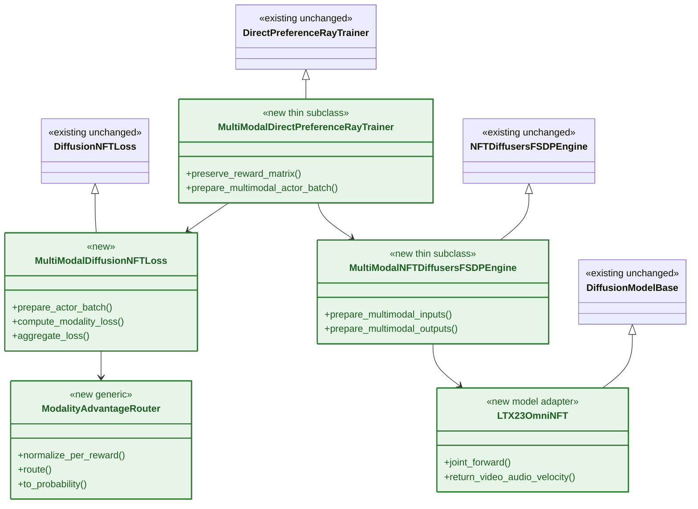

目标路径以轻量扩展保持旧类行为不变：新 Trainer 保留完整的5个 Reward 并调用 `ModalityAdvantageRouter`，多模态 Loss 分别计算 video/audio loss，新的 FSDP Engine 负责组织联合 forward。新增 `LTX23OmniNFT` 直接继承现有 `DiffusionModelBase`，在 adapter 内将模型输出转换为命名的 video/audio velocity。

### 3.5 新旧路径隔离

| 注册项               | 现有路径                          | OmniNFT 新路径                           |
| -------------------- | --------------------------------- | ---------------------------------------- |
| Algorithm            | `diffusion_nft` / `flow_grpo` | `omni_nft`                             |
| Loss                 | `diffusion_nft`                 | `multimodal_diffusion_nft`             |
| LTX rollout adapter  | `(LTX2Pipeline, flow_grpo)`     | `(LTX2Pipeline, omni_nft)`             |
| LTX training adapter | `(LTX2Pipeline, flow_grpo)`     | `(LTX2Pipeline, omni_nft)`             |
| Engine model type    | `diffusion_nft_model`           | `multimodal_diffusion_nft_model`       |
| Reward manager       | `MultiVisualRewardManager`      | `MultiModalRewardManager`              |
| Trainer              | `DirectPreferenceRayTrainer`    | `MultiModalDirectPreferenceRayTrainer` |

公共代码只增加 import、registry 和可选 protocol dispatch，不改变旧 key 的实例化结果和行为。

## 4. Rollout 适配

### 4.1 现有 Rollout 类关系

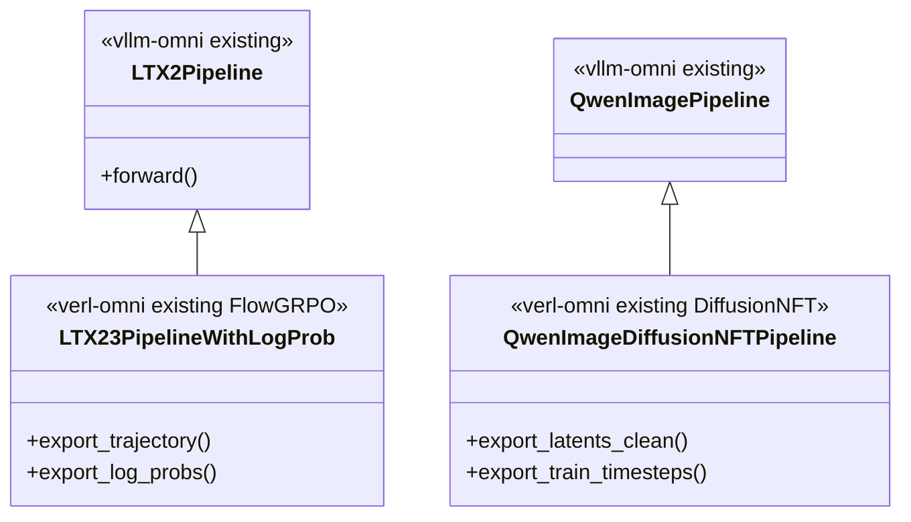

现状是：

- `LTX23PipelineWithLogProb` 返回 FlowGRPO 所需的 selected trajectory、next latent、timestep 和 log-prob；
- `QwenImageDiffusionNFTPipeline` 返回单模态 final clean latent 和 train timesteps；
- 当前不存在 LTX-2.3 的 DiffusionNFT/OmniNFT final clean A/V latent。

### 4.2 目标 Rollout 类关系

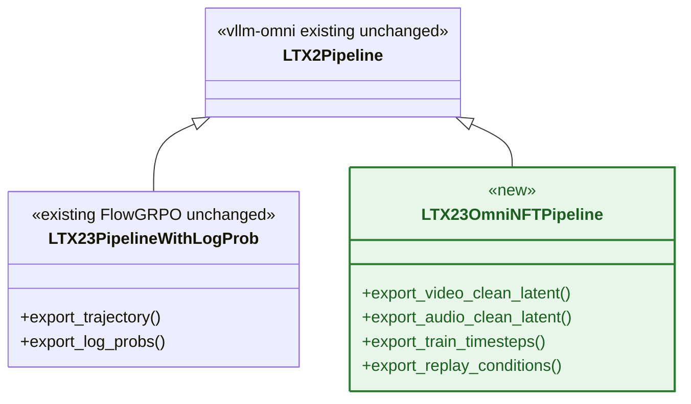

`LTX23OmniNFTPipeline` 直接继承 LTX 基础 pipeline。OmniNFT 不需要 CPS/SDE trajectory 和 reverse-process log-prob，只需要最终 clean latent 和可 replay 条件。

### 4.3 现有与目标调用流程

现有 LTX FlowGRPO：

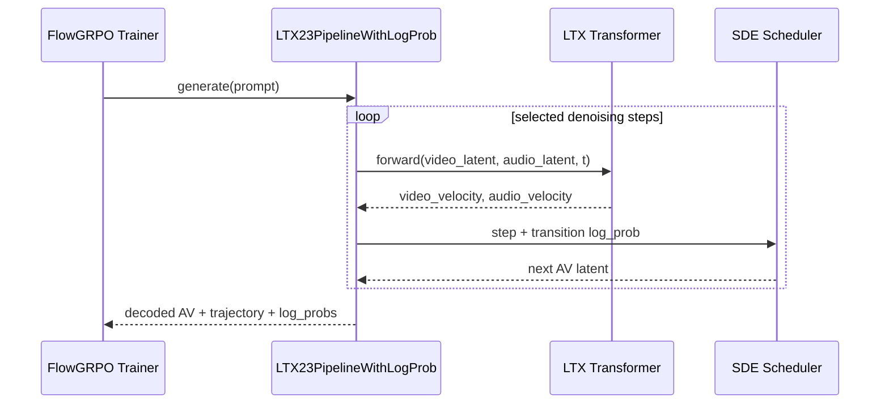

目标 LTX OmniNFT：

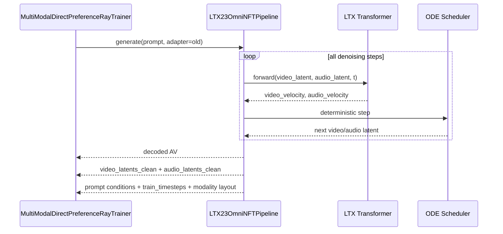

两条流程复用同一个 LTX 联合音视频生成主干，但输出目的不同：FlowGRPO pipeline 需要保存 trajectory 与 transition log-prob；OmniNFT pipeline 使用 old policy 完成整段生成，只向 Trainer 返回 decoded AV、最终两路 clean latent 及可复现 Actor forward 的条件。OmniNFT rollout 不承担 advantage routing 和 loss 计算，也不需要输出 reverse-process log-prob。

### 4.4 Rollout 数据结构

返回结构化字段：

```text
uid / sample_uid
decoded.video
decoded.audio
decoded.audio_sample_rate
modalities.video.latents_clean
modalities.audio.latents_clean
conditioning.video_prompt_embeds
conditioning.audio_prompt_embeds
conditioning.negative_video_prompt_embeds
conditioning.negative_audio_prompt_embeds
conditioning.attention_masks
layout.video_seq_len
layout.audio_seq_len
layout.fps
train_timesteps
```

如果底层传输必须使用拼接 tensor，返回：

```text
latents_clean = concat(video_latents_clean, audio_latents_clean)
modality_layout = {video: [0, Nv), audio: [Nv, Nv+Na)}
```

## 5. Reward 适配与共卡混部

现状存在两层约束：

1. 算法涉及不同模态的多个混合奖励，并且奖励模型的参数规模有的大有的小，实现形态不一，要经过一定的编排才能平衡内存和性能方面的开销。
2. 客户层面的训练集群对资源利用率有严格的要求，没有办法用例如独立的奖励资源池，因此考虑把奖励模型和rollout/actor共卡部署，保证资源利用率可控。对于共卡的内存占用，需要对模型进行offload管理。
3. 在上述约束下，必须使用同步的范式。

### 5.1 现有 Reward 类关系

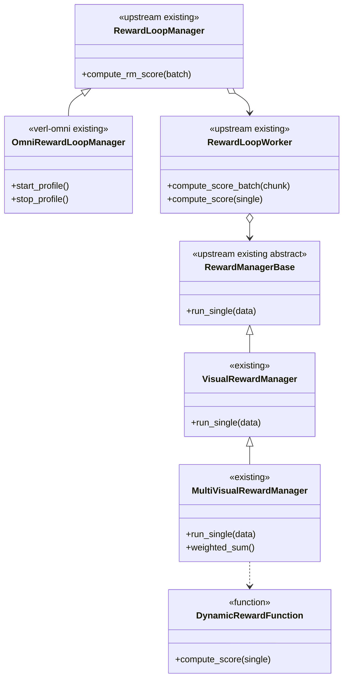

当前 `RewardLoopManager.compute_rm_score()` 在 Controller 层同步阻塞，但每个 `RewardLoopWorker.compute_score_batch()` 会为 local chunk 中的每条样本创建异步 task，最终调用多个 `run_single()`。`MultiVisualRewardManager` 再在单样本内部顺序调用多个函数，并将结果直接加权成 scalar。

### 5.2 现有 Reward 调用流程

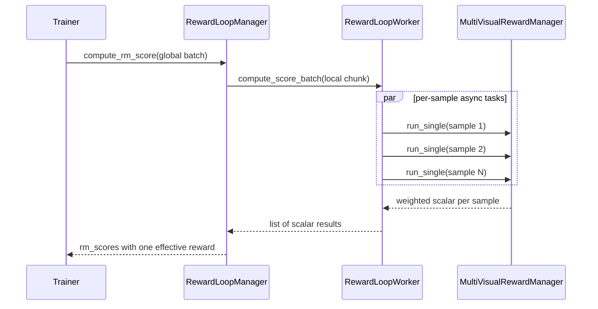

这一方式不适合 OmniNFT：

- 五列 Reward 在 advantage 前已经被合并；
- 模型推理是单样本，非 batch 的形式；
- 多个并发 `run_single()` 无法安全控制同一卡上的 load/offload；
- device 全局 cache 持有模型引用时，`empty_cache()` 不能释放模型显存。

### 5.3 目标 Reward 类关系

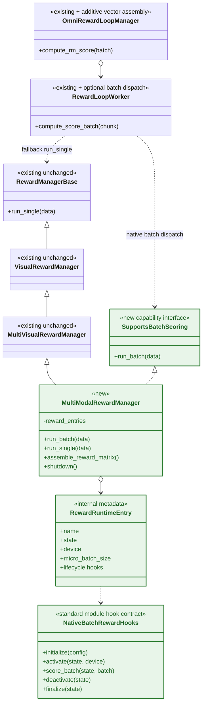

`OmniRewardLoopManager` 负责将 global batch 分片并汇聚各 Worker 的 `[B,K]` Reward 矩阵；`RewardLoopWorker` 仅在 Manager 满足 `SupportsBatchScoring` 时调用 `run_batch()`，未经过该适配的 Manager 仍完整保留原 `compute_score()` + `run_single()` 路径。`MultiModalRewardManager` 复用 `MultiVisualRewardManager` 的接入位置，但保留每个 Reward 的独立输出，并通过内部 `RewardRuntimeEntry` 调用标准模块生命周期 hooks 完成 activate、batch score 和 deactivate。

`RewardRuntimeEntry` 作为 Manager 内部 dataclass/dict，不作为外部公共抽象；`SupportsBatchScoring` 是批量评分能力标记，不改变 `RewardManagerBase` 和现有 Reward Manager 的公共接口。

`RewardRuntimeEntry` 与 `NativeBatchRewardHooks` 为组合关系：Entry 只保存单个 Reward 的运行时元数据和不透明状态，并把生命周期操作委托给对应 Hooks；下面是一个 HPSv3 模型适配的举例，

```python
@dataclass
class RewardRuntimeEntry:
    name: str
    hooks: NativeBatchRewardHooks
    state: Any
    device: str
    micro_batch_size: int
    required: bool = True


entry = RewardRuntimeEntry(
    name="hpsv3",
    hooks=hpsv3_hooks,
    state=hpsv3_hooks.initialize(**reward_config),
    device="npu:0",
    micro_batch_size=2,
)
```

具体 Reward 可以用类实现 Hooks ：

```python
class HPSv3RewardHooks(NativeBatchRewardHooks):
    def initialize(self, **config): ...
    def activate(self, state, device): ...
    def score_batch(self, state, batch, micro_batch_size, **kwargs): ...
    def deactivate(self, state): ...
    def finalize(self, state): ...
```

当前方案优先采用更轻量的动态函数模块，不要求 Reward 代码继承框架基类。每个模块暴露同名生命周期函数，Manager 导入后将其包装为 `NativeBatchRewardHooks` 并放入 Entry；不同模块拥有独立 namespace 和 `state`，因此同名函数不会冲突。

```python
# hpsv3_reward.py
def initialize(**config): ...
def activate(state, device): ...
def score_batch(state, batch, micro_batch_size, **kwargs): ...
def deactivate(state): ...
def finalize(state): ...
```

### 5.4 显式 Batch 调度规则

Worker 增加一个向后兼容的可选 dispatch：

```text
Manager 满足 SupportsBatchScoring
  -> 对整个 local chunk 调用一次 run_batch

Manager 不满足 SupportsBatchScoring
  -> 保持原有 compute_score + run_single + asyncio.gather
```

`MultiModalRewardManager.run_single()` 仅用于兼容和调试，语义为 `run_batch(batch_size=1)`；正式训练始终调用 `run_batch(local_chunk)`。

返回的数据结构同样按新旧路径分支：旧 Manager 的 scalar 结果继续由原逻辑写入 token-aligned `rm_scores`；仅当使用 `MultiModalRewardManager` 时，`OmniRewardLoopManager` 才收集各 Worker 的 local Reward 矩阵并拼接为 sample-aligned `[B,K]` Reward 矩阵。这里不在单卡 local shard 内做组内归一化，完整 batch 汇聚后再由 advantage router 按全局 prompt group 计算各模态优势。

OmniNFT 将 `reward.num_workers` 解释为 Native Reward 的 DP 副本数（不是普通 CPU 并发数）。`OmniRewardLoopManager` 必须把每个 Worker colocate 到 `global_pool` 的一个 device 上，并由 Worker 通过运行时 local rank/`get_device_id()` 获取本地 NPU。单卡 Reward 模式要求一张 NPU 最多绑定一个 Worker，每个 Worker 在本地持有五个 Reward 的完整状态。初始化时校验 Worker 数不超过 `global_pool.world_size`，并保证 Worker、device 与 local shard 一一对应。

以 8 张 NPU、64 条样本为例，`reward.num_workers=8` 表示创建 8 个设备绑定的 Reward Worker；Controller 将 global batch 均衡切为 8 个 local chunk，每个 `MultiModalRewardManager` 只处理本卡 8 条样本并返回 `[8,K]`，最后由 `OmniRewardLoopManager` 按 `sample_uid/global_index` 汇聚和恢复为 `[64,K]`。该集合过程使用 Ray object gather，不要求 `NativeBatchRewardHooks` 或 `MultiModalRewardManager` 实现跨卡 collective。

### 5.5 目标 Reward 调用流程

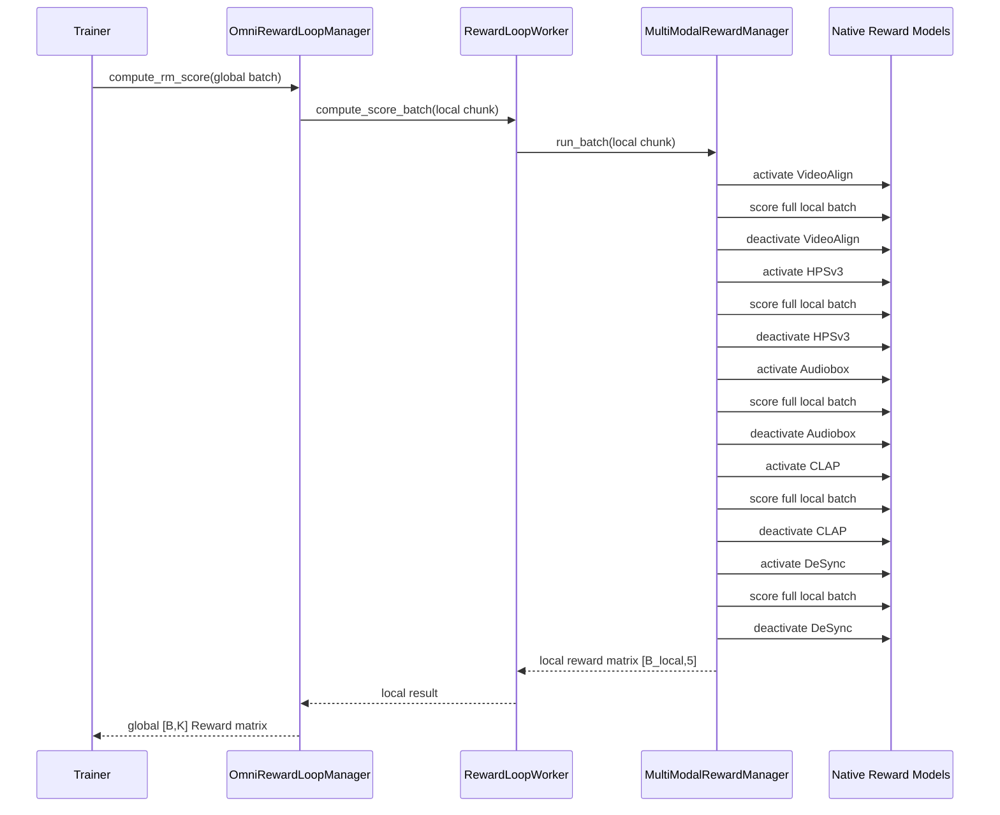

默认情况下，同一 Worker 内五个模型按顺序 activate/score/deactivate；多个 Worker/设备并行处理各自 local shard。若 template 声明 `parallel_groups`，同组小模型按顺序 activate 后并行 score，完成 stream 同步后再按顺序 deactivate。所有路径都在 `finally` 中完成清理，避免异常时泄漏显存。

### 5.6 Reward 生命周期接口

每个 Reward 模块使用固定名称的轻量函数接入：

```python
def initialize(**config) -> Any: ...
def activate(state, device: str) -> None: ...
def score_batch(state, batch, micro_batch_size: int, **kwargs) -> dict: ...
def deactivate(state) -> None: ...
def finalize(state) -> None: ...  # optional
```

Manager 根据每个 Reward 的独立 `path` 导入模块并按上述固定名称查找函数，不在 recipe 中重复配置函数名。不同 Reward 模块拥有独立 namespace 和 `state`，因此同名 hooks 不会冲突；禁止使用模块级模型 singleton 共享可变状态。

语义如下：

| 接口            | 语义                                                           |
| --------------- | -------------------------------------------------------------- |
| `initialize`  | 在 CPU 创建状态、processor 和 checkpoint handle，不占 NPU 显存 |
| `activate`    | 将当前模型迁移/加载到目标 NPU                                  |
| `score_batch` | 对整个 local shard 或其 micro-batch 执行评分                   |
| `deactivate`  | 将模型移回 CPU并释放 device 引用                               |
| `finalize`    | 删除 CPU/NPU 状态，用于 worker shutdown                        |

`state` 是 Manager 持有的进程内不透明对象，不进入 `DataProto`，不跨进程传输。单个 Reward 返回：

```text
scores:             FloatTensor[B_local]
valid_mask:         BoolTensor[B_local]
metrics:            dict
model_revision:     str
definition_version: str
```

训练 Reward 全部配置为 required；异常、缺失、非有限值必须使当前 step 失败并完成清理，不能静默替换为 0。

### 5.7 Reward 输出数据结构

```text
rm_scores:          FloatTensor[B,K]
reward_valid_mask:  BoolTensor[B,K]
reward_names:       list[str]
sample_uid:         list[str]
```

`MultiModalRewardManager` 不计算 weighted sum、advantage 或模态路由。Reward 顺序必须 `reward_names` 显式绑定。

## 6. Advantage Routing 与 Actor/Loss 适配

### 6.1 现有 Actor/Loss 调用流程

当前 DiffusionNFT 是单模态、单 reward probability 路径：

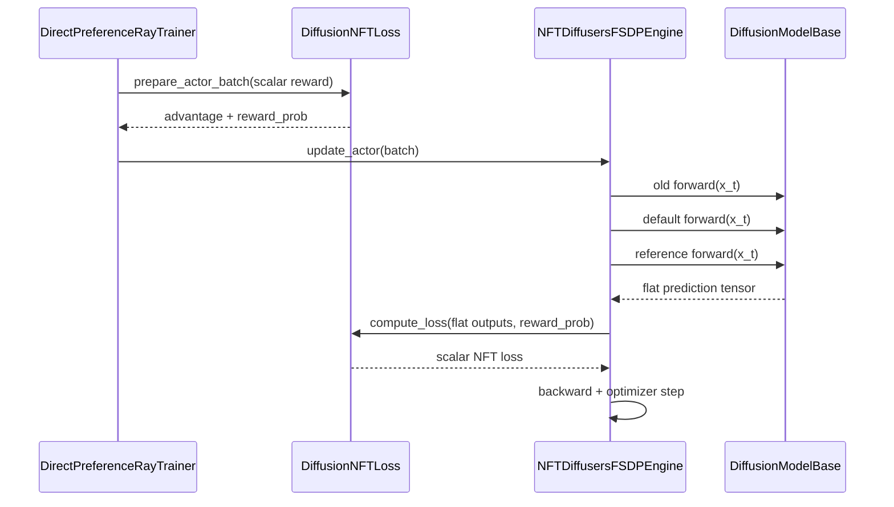

当前 `DiffusionNFTLoss` 会将除 batch 维之外的 tensor 统一 reduction；如果直接拼接 video/audio token，会导致两种模态共用同一个 probability，且 token 较多的模态获得隐式更大权重。

### 6.2 目标 Actor/Loss 类关系

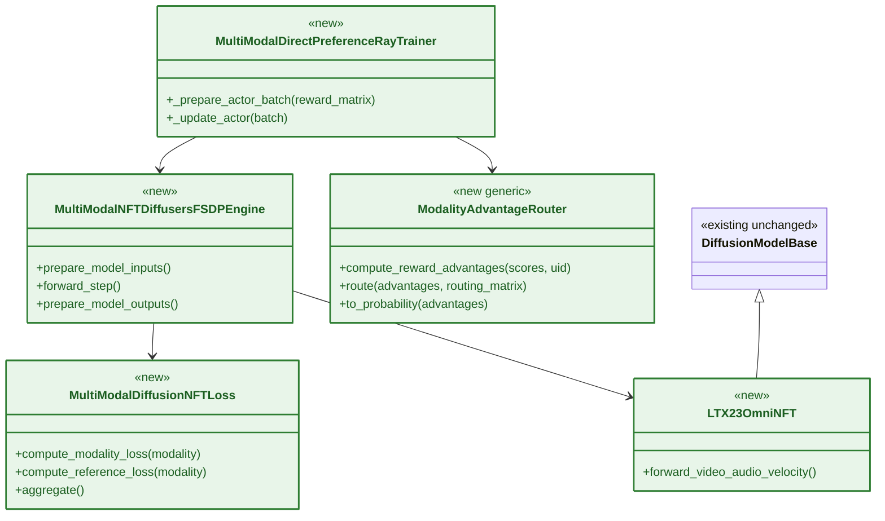

`MultiModalDirectPreferenceRayTrainer` 是流程编排入口：先调用 `ModalityAdvantageRouter` 将 `[B,K]` Reward 矩阵路由为 video/audio probability，再把结构化 Actor batch 交给新的 FSDP Engine。Engine 负责组织模型 forward 和 Loss 调用；`LTX23OmniNFT` 直接继承现有 `DiffusionModelBase`，只封装 LTX 特有的联合 AV 输入输出转换；`MultiModalDiffusionNFTLoss` 计算两个模态的 loss。

### 6.3 目标 Actor/Loss 调用流程

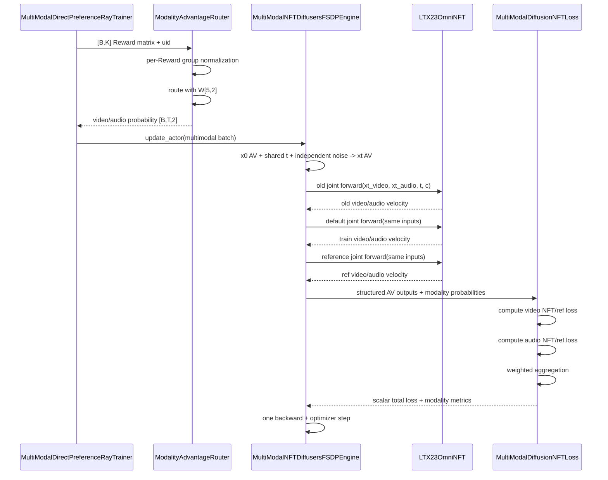

调用流程分为 routing 和 actor update 两段。Trainer 先完成按 prompt group 的5个 Reward 归一化与模态路由；随后 Engine 基于 rollout clean latent 构造共享 timestep、独立 AV 噪声的同一组 $x_t$，并让 old/train/reference policy 使用完全相同的输入执行三次联合 forward。Loss 分别归约 video/audio NFT 与 reference loss，合成为一个 scalar，最终只执行一次 backward 和 optimizer step。

### 6.4 Actor Batch 数据结构

进入 actor 的核心字段：

```text
rm_scores                                      [B,K]
reward_advantages                              [B,K]
modality_advantages                            [B,2]
modality_reward_probs                          [B,2]
timestep_modality_reward_probs                 [B,T,2]
modalities.video.latents_clean
modalities.audio.latents_clean
conditioning.*
modality_layout
```

### 6.5 模型输出数据结构

old/default/reference 使用完全相同的 $x_t^v,x_t^a,t,c$，并返回：

```text
old_predictions.video / audio
forward_predictions.video / audio
ref_predictions.video / audio
x0.video / audio
xt.video / audio
t_expanded
```

Actor forward 输出的是两路 velocity，而不是 clean latent。Loss 根据 $\hat x_0=x_t-tv$ 构造 clean prediction，再与 rollout clean latent 比较。

### 6.6 分模态 Reduction 与 CP

Reduction 发生在每个 actor update step 内部：位于 old/train/reference forward 之后、`backward()` 之前。模型首先产生 video/audio 的逐位置 NFT loss；loss 层再将它们分别归约为两个模态标量，最后组合成一次反向传播所需的 `total_loss`：

```text
actor forward
  -> video/audio element-wise loss
  -> modality-wise sum/count reduction
  -> CP global reduction（CP > 1 时）
  -> video_loss + audio_loss
  -> total_loss.backward()
  -> FSDP gradient reduce-scatter / synchronization
```

设 $m\in\{v,a\}$ 表示视频或音频，$\mathcal L_{m,i}$ 是第 $i$ 个 latent 位置的逐元素 loss，$M_{m,i}$ 是 padding、无效 token 和无效样本对应的有效性 mask。每个 CP rank 先计算本地 loss sum 和有效元素数：

$$
S_m=\sum_i M_{m,i}\mathcal L_{m,i},\qquad
C_m=\sum_i M_{m,i}.
\tag{15}
$$

如果 CP 切分了 AV sequence，各 rank 只持有部分 latent token，因此需要在 CP group 内分别聚合每个模态的分子和分母：

$$
\mathcal L_m=
\frac{\operatorname{AllReduce}(S_m)}
{\operatorname{AllReduce}(C_m)}.
\tag{16}
$$

不能先对各 rank 做 local mean 再平均，因为各 rank 的有效 token 数可能不同；也不能将 AV token 拼接后做统一 global mean，否则 token 更多的视频模态会获得隐式更大的权重。正确语义是先得到独立归一化的 $\mathcal L_v$ 和 $\mathcal L_a$，再通过显式的 $\lambda_v$、$\lambda_a$ 组合。

伪代码如下：

```python
video_sum, video_count = masked_sum_count(video_element_loss, video_valid_mask)
audio_sum, audio_count = masked_sum_count(audio_element_loss, audio_valid_mask)

if cp_world_size > 1:
    video_sum, video_count = cp_reduce_sum_and_count(video_sum, video_count)
    audio_sum, audio_count = cp_reduce_sum_and_count(audio_sum, audio_count)

video_loss = video_sum / video_count.clamp_min(1)
audio_loss = audio_sum / audio_count.clamp_min(1)
total_loss = lambda_video * video_loss + lambda_audio * audio_loss

total_loss.backward()  # 随后由 FSDP 处理参数梯度通信
```

`cp_reduce_sum_and_count()` 表示语义接口，实际实现复用 verl-omni 已有的 CP loss/gradient scaling 工具，来处理 autograd、CP world size 与 FSDP 梯度平均规则。

### 6.7 Loss 与指标输出

最终只生成一个用于 backward 的 scalar：

```text
video_nft_loss
audio_nft_loss
video_ref_loss
audio_ref_loss
total_loss
```

记录：

```text
actor/video/positive_loss
actor/video/negative_loss
actor/video/ref_loss
actor/video/reward_prob_mean
actor/audio/positive_loss
actor/audio/negative_loss
actor/audio/ref_loss
actor/audio/reward_prob_mean
actor/total_loss
```

两路分别计算 loss 不代表梯度完全隔离。共享参数和 cross-attention 参数仍接收：

$$
\nabla_\theta\mathcal L
=\lambda_v\nabla_\theta\mathcal L_v
+\lambda_a\nabla_\theta\mathcal L_a.
\tag{17}
$$

这属于 advantage routing 的设计边界；~~控制特定 attention 梯度路径需要另行实现 gradient surgery~~。

## 7. Policy 生命周期

### 7.1 Policy 状态

使用同一 base model 上的三种状态：

| 状态                | 用途                       | 梯度 |
| ------------------- | -------------------------- | ---- |
| `default` adapter | 当前训练策略               | 有   |
| `old` adapter     | rollout 与隐式正负策略基准 | 无   |
| disable adapter     | frozen reference           | 无   |

每轮顺序：

```text
old rollout
  -> rollout sleep/offload
  -> Reward score/offload
  -> default actor update
  -> Copy/EMA default to old
```

## 8. 数据集接入

训练集使用：

```text
OmniNFT/dataset/vggsound/train_metadata_20k.jsonl
```

固定版本包含 19,487 条 prompt group 记录。字段映射：

```text
prompt                    <- prompt_av
reward_inputs.text.video  <- prompt_v
reward_inputs.text.audio  <- prompt_a
source.index              <- idx
source.category           <- category
```

粒度区分：

```text
uid        = prompt group 粒度，同一 prompt 的 G 个候选共享
sample_uid = 单个 rollout 粒度
```

Reward 按 `sample_uid` 汇聚，advantage 按 `uid` 分组。默认每个 prompt 在线生成 $G=8$ 个候选。若同一 group 跨 DP rank，先按 `sample_uid` 汇聚全局 Reward，再按 `uid` 完成全局 group normalization；不能只基于每卡 local shard 计算 advantage。

## 9. 配置差异与最小示例

### 9.1 原有 Reward 与 OmniNFT Reward 配置对比

`SupportsBatchScoring` 是由 Manager 类实现的运行时能力，不增加 `supports_batch_scoring: true` 一类配置开关，避免配置声明与类实现不一致。recipe 通过选择 `MultiModalRewardManager` 进入新路径；Worker 检测到该能力后调用 `run_batch()`，其他 Manager 继续走原路径。

| 配置/语义       | 原有`MultiVisualRewardManager`                        | OmniNFT`MultiModalRewardManager`                                               |
| --------------- | ------------------------------------------------------- | -------------------------------------------------------------------------------- |
| Manager 选择    | `reward.reward_manager.name=MultiVisualRewardManager` | `reward.reward_manager.name=MultiModalRewardManager`                           |
| Worker dispatch | 原`compute_score()` + `run_single()`                | 由`SupportsBatchScoring` 选择 `run_batch(local_chunk)`                       |
| Reward 函数入口 | `path + name=compute_score`，单样本调用               | `path` 指向实现固定名称 lifecycle hooks 的模块                                 |
| 推理粒度        | 每个 sample 调用一次函数                                | 每个 Reward 对 local shard 做真正 batch inference                                |
| 聚合方式        | `aggregation: weighted_sum`                           | 新增`aggregation: preserve_components`                                         |
| Manager 输出    | 每个 sample 一个 scalar                                 | sample-aligned`[B,K]` Reward 矩阵                                              |
| Reward 顺序     | weighted sum 不依赖列顺序                               | 新增`component_order`，显式固定矩阵列与名称                                    |
| 模态路由        | 无                                                      | 每个 Reward 配置`routing_weights.video/audio`                                  |
| 模型生命周期    | 通常由函数级 cache 持有                                 | 未分组模型逐个驻留；`parallel_groups` 声明可同时驻留并评分的小模型组           |
| 资源位置        | 可使用函数本地模型或独立 Reward server                  | 当前实现只用本地模型后端，且与 actor/rollout 共卡，`reward_model.enable=false` |
| 独立资源池      | 可配置`reward_model.enable_resource_pool`             | 固定为`false`，避免空闲资源池被回收                                            |

`aggregation: preserve_components` 只表示 Manager 不提前加权合并 K 个分量；advantage normalization 和 modality routing 仍由 `ModalityAdvantageRouter` 完成。现有 `weighted_sum` 行为保持不变。

### 9.2 OmniNFT 最小配置

下列 `native`、`component_order` 和 `preserve_components` 属于新增配置；生命周期 hook 名称采用代码约定，不进入 recipe，其余字段沿用现有 Reward 配置层级。

```yaml
algorithm:
  name: omni_nft
  adv_mode: branch_aware

actor_rollout_ref:
  actor:
    diffusion_loss:
      loss_mode: multimodal_diffusion_nft
      video_weight: 1.0
      audio_weight: 1.0
  model:
    engine_model_type: multimodal_diffusion_nft_model
  rollout:
    algorithm: omni_nft
    rollout_adapter: old

reward:
  num_workers: 8

  # 不创建独立 Reward server/resource pool。
  reward_model:
    enable: false
    enable_resource_pool: false

  reward_manager:
    name: MultiModalRewardManager
    module:
      path: pkg://verl_omni.reward_loop.reward_manager

  # 不在 Manager 内做 weighted sum，保持 K 个独立分量。
  aggregation: preserve_components
  component_order: [video_align, hpsv3, audiobox, clap, desync]

  native:
    # num_workers=8 对应 global_pool 上 8 个单卡 Reward DP 副本。
    placement: actor_rollout
    # 由 Ray/Worker 运行时解析本地设备，不为单个 Reward 写死 npu:x。
    device: local_rank
    parallel_groups: {}

  reward_functions:
    hpsv3:
      path: pkg://verl_omni.utils.reward_score.hpsv3_reward
      required: true
      model_path: /checkpoints/hpsv3
      micro_batch_size: 2
      routing_weights:
        video: 1.5
        audio: 0.0
```

其余四个 Reward 使用相同生命周期结构。`component_order` 必须和五个 `reward_functions` key 一一对应；`MultiModalRewardManager` 按该顺序组装 `[B,K]` Reward 矩阵，`ModalityAdvantageRouter` 再校验 Reward 名称、目标模态和路由权重完整性。

未加入任何 group 的 Reward 默认逐模型执行 activate、`score_batch()` 和 deactivate。对于能够同时放入 NPU 的小模型，可在 `native.parallel_groups` 中将它们声明为并行组；group 本身同时表达“组内模型共同驻留”和“组内模型并行评分”。

```yaml
reward:
  native:
    parallel_groups:
      visual_small:
        rewards: [video_align, hpsv3]
```

每个 Reward 最多属于一个 parallel group，组内至少包含两个模型。Manager 对每个组固定执行：按 `component_order` 依次 activate 全部模型、并行执行所有 `score_batch()`、同步 NPU stream、再依次 deactivate 全部模型。并发数自然等于组内 Reward 数量。配置校验需要拒绝未知 Reward、重复分组和单元素 group

## 10. JavisBench-mini 离线评测

评测使用 [JavisBench](https://github.com/JavisDiT/JavisDiT) 协议，采用公开的 [JavisBench-mini](https://huggingface.co/datasets/JavisVerse/JavisBench/blob/main/JavisBench-mini.csv)。该子集从完整 JavisBench 的 10,140 条数据中选取 1,000 条 prompt，按 240P、4 秒联合音视频协议评测。

评测不进入 RL 训练闭环。按照 OmniNFT 主实验报告：

| 维度             | 指标                                     | 方向                                         |
| ---------------- | ---------------------------------------- | -------------------------------------------- |
| AV-Quality       | `VQ`、`AQ`                           | 越高越好                                     |
| Text-Consistency | `TV-IB`、`TA-IB`、`CLIP`、`CLAP` | 越高越好                                     |
| AV-Consistency   | `AV-IB`、`AVHScore`                  | 越高越好                                     |
| AV-Synchrony     | `JavisScore`、`DeSync`               | `JavisScore` 越高越好，`DeSync` 越低越好 |

第一阶段固定使用 vllm-omni LTX-2.3 一阶段 pipeline。Base 与训练后 checkpoint 必须使用完全相同的：

- prompt、seed；
- 分辨率、`num_frames=97`、`fps=24`；
- denoise steps、CFG/STG/modality guidance；
- negative prompt；
- evaluator revision、抽帧与预处理。

当前实验用于验证固定一阶段 pipeline 上的 RL 相对提升，不与论文 LTX-2 的绝对分数直接等同。

## 11. 分阶段实现与单点验证

| 阶段 | 功能增量                                                                      | 独立验证里程碑                                                                             |
| ---- | ----------------------------------------------------------------------------- | ------------------------------------------------------------------------------------------ |
| 0    | 冻结现有 LTX FlowGRPO、Qwen-Image DiffusionNFT、MultiVisualRewardManager 基线 | 原 recipe 与单测结果固定                                                                   |
| 1    | 新 recipe、JSONL 数据集和 registry 骨架                                       | 旧 key 实例化旧类；新 key 实例化新类                                                       |
| 2    | `LTX23OmniNFTPipeline`                                                      | 保存 decoded AV、两路 clean latent、conditions；可离线 replay                              |
| 3    | `MultiModalRewardManager.run_batch` + fake Reward hooks                     | 单 Worker 对 local batch 返回稳定的`[B,K]` Reward 矩阵，旧 Manager 仍走 `run_single()` |
| 4    | Reward activate/score/deactivate 生命周期                                     | fake 大模型验证卡内单驻留、异常清理和显存回落                                              |
| 5    | `ModalityAdvantageRouter`                                                   | 固定`[B,K]` Reward 矩阵精确得到 reward advantage、AV 双路广播和两路 probability          |
| 6    | `LTX23OmniNFT` + 双模态 NFT loss                                            | 固定 probability 下完成联合 forward、分模态 loss 和一次 backward                           |
| 7    | 五个真实 Native Reward                                                        | Batch 数值与单样本参考一致，顺序 offload 通过                                              |
| 8    | FSDP2、CP、完整共卡闭环                                                       | 多步训练、checkpoint/resume、old policy 更新和显存生命周期通过                             |
| 9    | JavisBench-mini                                                               | Base 与训练后 checkpoint 完成固定协议对比                                                  |

开发解耦依赖 replay artifact：Rollout 可先保存 decoded media、clean AV latent 和 conditions；Reward、routing、loss 可在不等待实时 rollout 的情况下独立开发和数值验证。

## 12. 测试与兼容性要求

### 12.1 Rollout

1. final clean AV latent 经 decoder 后与在线 rollout media 一致；
2. replay conditions 能在 actor 端构造相同 prompt context；
3. OmniNFT adapter 不生成 trajectory/log-prob；
4. 原 LTX FlowGRPO adapter 输出不变。

### 12.2 Reward

1. `run_batch(B)` 与逐样本参考结果数值一致；
2. Reward 输出顺序由 `reward_names` 显式绑定；
3. 每个模型只 activate 一次、处理完整 local shard 后 deactivate；
4. 任一 Reward 异常后仍执行 deactivate；
5. `MultiVisualRewardManager` 继续返回原 scalar 行为；
6. 多卡 gather 后的 `[B,K]` Reward 矩阵与 `sample_uid` 一一对应。

### 12.3 Routing

1. 五列分别按 `uid` 做 group normalization；
2. DeSync advantage 同时进入 video/audio；
3. VideoAlign/HPSv3 不进入 audio；Audiobox/CLAP 不进入 video；
4. 单 Reward 常数列、零方差和非法值处理符合配置；
5. DP 分片不改变全局 advantage。

### 12.4 Actor/Loss

1. old/default/reference 使用相同 $x_t^v,x_t^a,t,c$；
2. video/audio 使用共享 timestep、独立 noise；
3. 两路 prediction、probability 和 mask 不串线；
4. total loss 等于四个配置项的加权和；
5. 一次 backward 同时产生 AV 相关参数梯度；
6. CP 符合精度范围。

### 12.5 旧功能回归

- Qwen-Image DiffusionNFT 仍使用 `DirectPreferenceRayTrainer + DiffusionNFTLoss + NFTDiffusersFSDPEngine`；
- LTX FlowGRPO 仍使用原 rollout/training adapter；
- `VisualRewardManager`、`MultiVisualRewardManager` 仍使用原 `run_single()` 路径；
- 未配置 `omni_nft` 时不会进入任何新类；
- 新增 optional batch dispatch 对旧 Manager 的返回值、异常和调度语义无影响。

## 13. 验收标准

1. LTX old policy 对每个 prompt 在线生成默认 $G=8$ 个联合音视频候选；
2. rollout 返回可训练的 video/audio clean latent，不保存 trajectory/log-prob；
3. 五个 Reward 在每张 NPU 上对 local shard 执行真正 Batch 推理，恢复全局 `[B,K]` Reward 矩阵；
4. 同一卡五个模型默认依次 activate/score/deactivate；配置 parallel group 时组内并行评分，且与 rollout/actor 阶段共卡无显存泄漏；
5. 五列 Reward 独立归一化，DeSync 进入两路，video/audio 得到不同 probability；
6. old/default/reference 完成同输入联合 forward，两路 NFT loss 只读取各自 probability；
7. 分模态 reduction 后汇总为一个 scalar，并完成一次 backward/optimizer step；
8. FSDP2 + CP 的 prediction、loss 和梯度与单卡基线一致；
9. checkpoint 可恢复数据进度、default/old policy、optimizer 和 routing 配置；
10. JavisBench-mini 在固定配置下完成 Base 与训练后 checkpoint 对比；
11. 原 LTX FlowGRPO、Qwen-Image DiffusionNFT 和现有 Reward Manager 行为不变。
